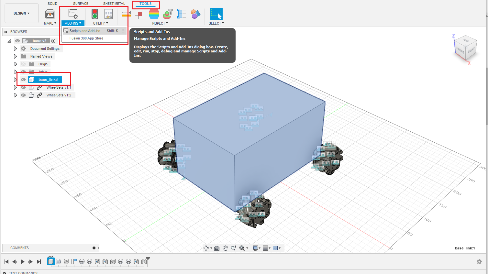
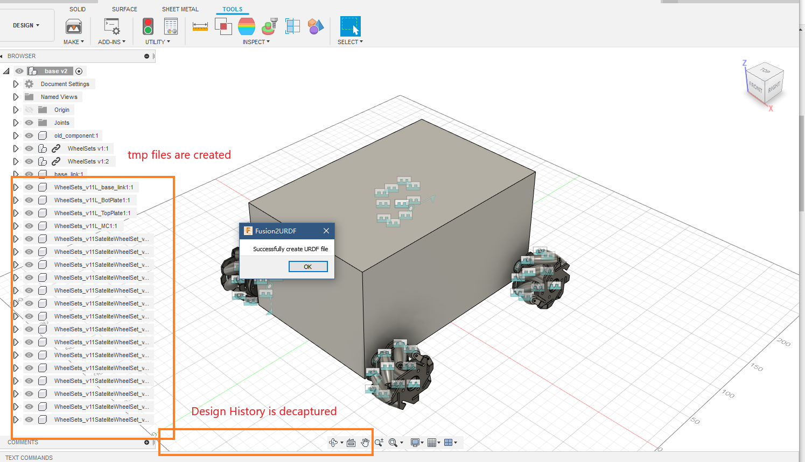

# Fusion2Pybullet

[简体中文](README.zh.md) | English

Developed from [@syuntoku14/fusion2urdf](https://github.com/syuntoku14/fusion2urdf). 

### What is this script?

A Fusion 360 script to export urdf files. This is a PyBullet adpative version. 

Note: Only support "Revolute", "Rigid" and "Slider" joint currently. Also I don't have plans to work on rigid group and other types of joints.

This exports:

* .urdf files of the model
* .stl files of your model
* A example hello.py to load your model into PyBullet.

---

**03/25/2020: Supporting exportation of nested components.**

03/27 update: Add "Do not Capture Design History" to fix InternalValidationError. See [Developer Notes](https://github.com/yanshil/Fusion2Pyblluet/wiki/Developer-Notes)

03/27 update2: Add a supplementary script **Joint2Graphviz** to check assembled structures.


### Fusion Add-in
Add this script into Fusion 360 via Tools -> Add-Ins




#### Before using this script

1. Some other notes for getting avoid of warnings: 
   1. Change language preference to English
   2. Rename any full-width symbol to half-width symbol (like `。` and `（）`)
2. Set up `base_link`
3. Suggestion: Use [**Joint2Graphviz**](https://github.com/yanshil/Joint2Graphviz) to check your assembled structure! 
4. **Check if your default unit is mm or not. If you set it to some other unit, you need to manually adjust the scale when exporting the stl fils. [See FAQ](#faq)** 

#### Using script inside Fusion 360: Example

1. Set up the components properly

- [x] Unit should be mm

- [x] A base_link

- [x] Check component and joint names (Set English as the language if necessary)

- [x] **IMPORTANT! Set up joints properly** 

	* Supplementary script: **Joint2Graphviz** will generate a txt file capable for Graphviz. Copy the content to [WebGraphviz](http://www.webgraphviz.com/) to check the graph. Usually a correct model should be a DAG with 'base_link' as the only root.
	
	* In fusion, when you hit 'J' to assemble joints, note that the exporter consider **component 1 as 'child' and component 2 as 'parent'**. For example, when you want to assemble a 4-wheel car with middle cuboid as `base_link`, you should assemble the vehicle with wheel as component 1 and 'base_link' as component 2.

	* For example, you should be assemble your model to make result of `check_urdf simple_car.urdf`  like the following. i.e. BL, BR, FL, FR as component 1 and base_link as component 2 when you assemble these 4 joints.
	```
    robot name is: simple_car
	  ---------- Successfully Parsed XML ---------------
	  root Link: base_link has 4 child(ren)
	      child(1):  BL_1
	      child(2):  BR_1
	      child(3):  FL_1
	      child(4):  FR_1
	```

2. Run the script and select storing location
   * Note: **Don't save** your file after running the scripts! DesignType will be set to "Direct Mode" and some temporary components will be created. That's not the changes you want!
   * 
   * 
   * 
   
3. Enjoy from `python hello_bullet.py` !

## FAQ

###  What to do when error pops out

* Bugs are usually  caused by wrongly set up joints relationships
* Nest-component support might also lead to undocumented bugs. So remove the nesting structure helps a lot.

Since the script still cannot showing warnings and errors elegantly, if you cannot figure out what went wrong with the model while bugs are usually  caused by wrongly set up joints relationships, you can do the following things:

1. Make sure every joints are set up correct (parent and child relationship). If failed ---> 
2. Re-tidy your design to make it not include any nest-components. Use this script. If failed --->  
3. Try the stable version [Branch: stable](https://github.com/yanshil/Fusion2Pyblluet/tree/stable).
4. Run with debug mode and check what happens 

### How to check if I assembled my links and joints correctly

A supporting script here: [Joint2Graphviz](https://github.com/yanshil/Joint2Graphviz) for details

### What if my unit is not mm

You have to modify `Bullet_URDF_Exporter/core/Link.py`. Search `scale`

(Please ping me if you find any other place that should also be modified)

```
        # visual
        visual = SubElement(link, 'visual')
        origin_v = SubElement(visual, 'origin')
        origin_v.attrib = {'xyz':' '.join([str(_) for _ in self.xyz]), 'rpy':'0 0 0'}
        geometry_v = SubElement(visual, 'geometry')
        mesh_v = SubElement(geometry_v, 'mesh')
        mesh_v.attrib = {'filename': self.repo + self.name + '.stl','scale':'0.001 0.001 0.001'} ## scale = 0.001 means mm to m. Modify it according if using another unit
        material = SubElement(visual, 'material')
        material.attrib = {'name':'silver'}
        
        # collision
        collision = SubElement(link, 'collision')
        origin_c = SubElement(collision, 'origin')
        origin_c.attrib = {'xyz':' '.join([str(_) for _ in self.xyz]), 'rpy':'0 0 0'}
        geometry_c = SubElement(collision, 'geometry')
        mesh_c = SubElement(geometry_c, 'mesh')
        mesh_c.attrib = {'filename': self.repo + self.name + '.stl','scale':'0.001 0.001 0.001'} ## scale = 0.001 means mm to m. Modify it according if using another unit
        material = SubElement(visual, 'material')
```