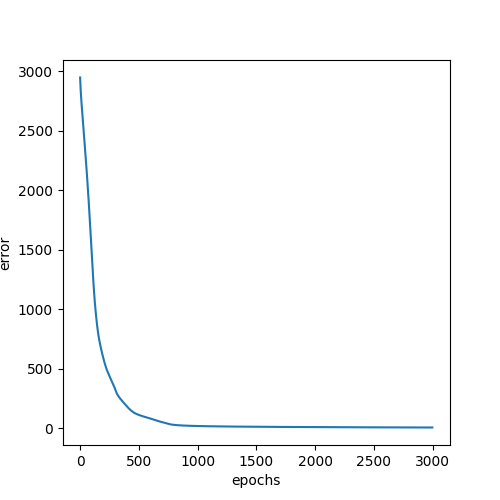
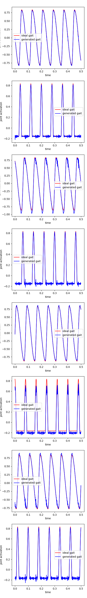
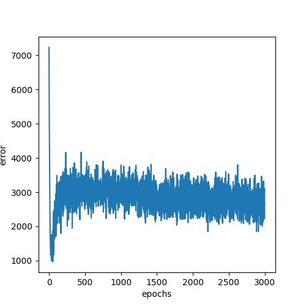
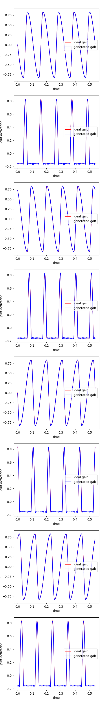

# OutputMLP training for multi speed gait generation
Experiments involve training the OutputMLP taking as input, fourier components obtained by using the integer multiples of fundamental frequency of the output signal. 
Experiments 1 to 4 use [Training File Link](train.py)
Experiments 5 and above use [Training File Link](train2.py)
**Need to perform experiments to test the effect of change of theta on performance**. Hypothesis is that since theta does not change fundamental frequency, any changes to it will not effect model performance.
## Experiment 1

- N = 10000
- nepochs = 1500 
- Tst = 60
- Tsw = 20
- dt = 0.001
- lr = 1e-3
- decreasing learning rate callback upon plateauing or increase in loss
- num\_osc=20
- num\_h=200
- num\_out=8
- fundamental frequency is computed using fft 

The following plot is the error plot for training

The following plot is the comparison of the reconstructed signal and the original signal

## Experiment 2
In Experiment 1, the signals were not normalized. 
- N = 500
- Tst = 60
- Tsw = 20
- dt = 0.001
- lr = 1e-3
- cyclic learning rate
- num\_osc=20
- num\_h=50
- num\_out=8
- fundamental frequency is computed using fft 
- nepochs = 3000

The following plot is the error plot for training

The following plot is the comparison of the reconstructed signal and the original signal

## Experiment 3
- N = 500
- Tst = 60
- Tsw = 20
- dt = 0.001
- lr = 1e-3
- cyclic learning rate
- num\_osc=40
- num\_h=200
- num\_out=8
- nepochs = 15000
- fundamental frequency is computed using fft

The following plot is the error plot for training

The following plot is the comparison of the reconstructed signal and the original signal

## Experiment 4
- N = 500 
- Tst = 60
- Tsw = 20
- dt = 0.001
- lr = 1e-3
- cyclic learning rate
- num\_osc=20
- num\_h=200
- num\_out=8
- nepochs = 30000
- fundamental frequency is computed using autocorr 

The following plot is the error plot for training:-

The following plot is the comparison of the reconstructed signal and the original signal:-

## Experiment 5
- N = [400, 530, 665, 800, 930, 500]
- Tst = [60, 80, 100, 120, 140, 75]
- Tsw = [20, 26, 33, 40, 46, 25]
- theta = [15, 15, 15, 15, 15, 15]
- dt = 0.001
- lr = 1e-3
- cyclic learning rate
- num\_osc=20
- num\_h=50
- num\_out=8
- nepochs = 3000
- fundamental frequency is computed using autocorr

The following plot is the error plot for training:-

The following plot is the comparison of the reconstructed signal and the original signal:-

## Experiment 6
- N = [400, 530, 665, 800, 930, 500]
- Tst = [60, 80, 100, 120, 140, 75]
- Tsw = [20, 26, 33, 40, 46, 25]
- theta = [15, 15, 15, 15, 15, 15]
- dt = 0.001
- lr = 1e-2
- cyclic learning rate
- num\_osc=20
- num\_h=200
- num\_out=8
- nepochs = 3000
- fundamental frequency is computed using autocorr

The following plot is the error plot for training:-

The following plot is the comparison of the reconstructed signal and the original signal:-

## Experiment 7
- N = [400, 530, 665, 800, 930, 500]
- Tst = [60, 80, 100, 120, 140, 75] 
- Tsw = [20, 26, 33, 40, 46, 25] 
- theta = [15, 15, 15, 15, 15, 15] 
- dt = 0.001
- lr = 1e-3
- cyclic learning rate
- num\_osc=10
- num\_h=30
- num\_out=8
- nepochs = 9000
- fundamental frequency is computed using autocorr

The following plot is the error plot for training:-

The following plot is the comparison of the reconstructed signal and the original signal:-

## Experiment 8
- N = [400, 530, 665, 800, 930, 500]
- Tst = [60, 80, 100, 120, 140, 75] 
- Tsw = [20, 26, 33, 40, 46, 25] 
- theta = [15, 15, 15, 15, 15, 15] 
- dt = 0.001
- lr = 1e-3
- cyclic learning rate
- num\_osc=8
- num\_h=16
- num\_out=8
- nepochs = 10000
- fundamental frequency is computed using autocorr

The following plot is the error plot for training:-

The following plot is the comparison of the reconstructed signal and the original signal:-

# ROBOT EXPERIMENTATION
Using the model from experiment 5, the following plot is obtained

## Experiment 9
- N = [400, 530, 665, 800, 930, 500]
- Tst = [60, 80, 100, 120, 140, 75] 
- Tsw = [20, 26, 33, 40, 46, 25] 
- theta = [15, 15, 15, 15, 15, 15] 
- dt = 0.001
- lr = 1e-3
- cyclic learning rate
- num\_osc=8
- num\_h=16
- num\_out=8
- nepochs = 10000
- fundamental frequency is computed using autocorr

The following plot is the comparison of the reconstructed signal and the original signal:-

Training files-
- train.py used for training with a single gait pattern
- train2.py used for training with multiple gait patterns
- dataloader.py dataloader for training with multiple gait patterns 
- train3.py used for training version 2 of the developed CPG

## Weight Visualization Experiments
### Experiment 1
- Linearly increasing Tst and Tsw. 
- Exponentially decreasing duty factor and calculated speed
- Training instances from 10 to 295
- Tst min value 60, increment by 4
- Tsw min value 20, increment by 4
- 285 instances of training
The following is parameter trends in the experiment data

The following is the tsne plot for pca components of the weights

# Pretraining Experiments
## Experiment 1
- All loss propagated throughout

## Experiment 2
- All loss propagated throughout
- Data is shuffled
- Loss plateaus at 588

## Experiment 3 
- Motion Encoder updated by separate loss 
- Additional Signal MSE updates all weights
- Loss plateaus at 588
- Data is shuffled

## Experiment 4
- Motion Encoder updated by separate loss
- Additional Signal MSE updates all weights
- Need to remove shuffling
