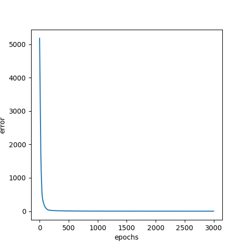

# OutputMLP training for multi speed gait generation
Experiments involve training the OutputMLP taking as input, fourier components obtained by using the integer multiples of fundamental frequency of the output signal. 
Experiments 1 to 4 use [Training File Link](train.py)
Experiments 5 and above use [Training File Link](train2.py)
**Need to perform experiments to test the effect of change of theta on performance**. Hypothesis is that since theta does not change fundamental frequency, any changes to it will not effect model performance.
## Experiment 1
Training the OutputMLP to reconstruct the control signal for a single speed.
The following assumptions hold true for this experiment:->
- The motion will be with a single speed
- No deviation from a straight line
- The aforementioned two points will lead to same fundamental frequency of the control signals for all legs

The learning rate for this experiment was 1e-3. 

It was observed from the loss plot that loss after a sudded decrease for the first time does not fall greatly. 
A larger learning rate is required

## Experiment 2
In Experiment 1, the signals were not normalized. 
- N = 500
- Tst = 60
- Tsw = 20
- dt = 0.001
- lr = 1e-3
- cyclic learning rate
- num\_osc=20
- num\_h=50
- num\_out=8
- fundamental frequency is computed using fft 

The following plot is the error plot for training

The following plot is the comparison of the reconstructed signal and the original signal

## Experiment 3
- N = 500
- Tst = 60
- Tsw = 20
- dt = 0.001
- lr = 1e-3
- cyclic learning rate
- num\_osc=40
- num\_h=200
- num\_out=8
- nepochs = 10000
- fundamental frequency is computed using fft

The following plot is the error plot for training

The following plot is the comparison of the reconstructed signal and the original signal

## Experiment 4
- N = 500 
- Tst = 60
- Tsw = 20
- dt = 0.001
- lr = 1e-3
- cyclic learning rate
- num\_osc=20
- num\_h=200
- num\_out=8
- nepochs = 30000
- fundamental frequency is computed using autocorr 

The following plot is the error plot for training:-

The following plot is the comparison of the reconstructed signal and the original signal:-

## Experiment 5
- N = [400, 530, 665, 800, 930, 500]
- Tst = [60, 80, 100, 120, 140, 75]
- Tsw = [20, 26, 33, 40, 46, 25]
- theta = [15, 15, 15, 15, 15, 15]
- dt = 0.001
- lr = 1e-3
- cyclic learning rate
- num\_osc=20
- num\_h=50
- num\_out=8
- nepochs = 3000
- fundamental frequency is computed using autocorr

The following plot is the error plot for training:-

The following plot is the comparison of the reconstructed signal and the original signal:-

## Experiment 6
- N = [400, 530, 665, 800, 930, 500]
- Tst = [60, 80, 100, 120, 140, 75]
- Tsw = [20, 26, 33, 40, 46, 25]
- theta = [15, 15, 15, 15, 15, 15]
- dt = 0.001
- lr = 1e-3
- cyclic learning rate
- num\_osc=20
- num\_h=200
- num\_out=8
- nepochs = 6000
- fundamental frequency is computed using autocorr

The following plot is the error plot for training:-

The following plot is the comparison of the reconstructed signal and the original signal:-

